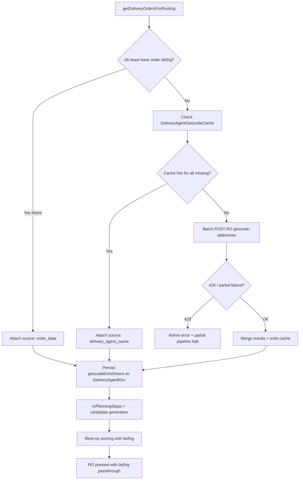

# Delivery Agent Lat/Lng Enrichment — Design Report

**Date:** 2026-05-30  
**Status:** Design only — no implementation in this milestone  
**Scope:** Temporary testing-stage geocoding via Route Optimization system; future-compatible with checkout-stored coordinates

---

## Executive summary

The Delivery Agent warning **"Lat/lng unavailable; meet-up scoring used area/address fallback"** appears because **Kapioo order data never supplies coordinates** into the planning pipeline. The agent was built for a **lat/lng-first planning profile**, but `getDeliveryOrdersForRouting()` → `RoutingStop` → `PlanningStop` always has empty `lat`/`lng` today.

Route Optimizer **already geocodes addresses internally** when Kapioo calls `optimize-preview` / `create-and-optimize`, but Kapioo **does not reuse those coordinates** for split/meet-up scoring — it only reads ETAs, durations, and `geocode_failures`.

**Recommended approach:** Add a **pre-planning enrichment step** in Kapioo that (1) uses order lat/lng when present, (2) reads a per-run geocode cache, (3) batch-calls a **new Route Optimizer geocode-only endpoint**, then (4) attaches enriched coordinates to in-memory `RoutingStop` / `PlanningStop` and persists them on `DeliveryAgentRun` — **without mutating customer orders**.

---

## A. Current Kapioo Admin / Delivery Agent side

### A1. Where does the Delivery Agent pull order/stops from?

| Step | File | What happens |
|------|------|--------------|
| Admin UI | `features/admin-delivery-agent/admin-delivery-agent-tab.tsx` | Calls `GET /api/admin/delivery-agent/preview-orders` |
| Preview API | `app/api/admin/delivery-agent/preview-orders/route.ts` | → `previewDeliveryOrdersForAgent()` |
| Order preview | `lib/agents/delivery/preview-delivery-orders.ts` | Uses `getDeliveryOrdersForRouting()` + pending slice from `getDailyOrdersBase()` |
| Routing adapter | `lib/agents/delivery/get-delivery-orders-for-routing.ts` | Reads `getDailyOrdersBase()`, validates, maps each order via `mapOrderToRoutingStop()` |
| Order read layer | `lib/order-data/get-daily-orders-base.ts` | Mongo `DailyDeliveryOrder` + effective customer/address merge |

Candidate generation and route preview **re-fetch** the same routing layer:

- `generateCandidatePlansForAgent()` → `getDeliveryOrdersForRouting()`
- `previewCandidatePlansPipeline()` → `getDeliveryOrdersForRouting()` → builds `routingStopByOrderId`
- `previewSimpleRouteForAgent()` → same

**Source of truth for stops:** `getDeliveryOrdersForRouting()` on confirmed orders for the delivery date.

---

### A2. Does current order data already contain any lat/lng fields?

**No — not in the read path used by Delivery Agent.**

| Layer | Lat/lng? |
|-------|----------|
| `DailyOrderBaseAddress` (`lib/order-data/types.ts`) | `unitNumber`, `streetAddress`, `city`, `province`, `postalCode`, `country`, `buzzCode`, `formatted` only |
| `mapOrderToRoutingStop()` | Does not map coordinates |
| `RoutingStop` (`lib/agents/delivery/types.ts`) | No `lat`/`lng` fields on the type |
| Mongo daily order models | No lat/lng fields found on order schemas |
| `classify-stop-for-planning.ts` | **Defensive read** of optional `stop.lat`, `stop.lng`, or `deliveryAddress.lat/lng` — but nothing populates them today |

The inspection report (`docs/delivery-agent-inspection-report.md`) confirms: **latitude/longitude are not stored anywhere** in Kapioo order records.

**Future hook (design for compatibility):** When checkout stores `deliveryAddress.lat` / `deliveryAddress.lng`, extend `DailyOrderBaseAddress` + `mapOrderToRoutingStop()` to pass them through with source `order_data`. Enrichment layer should treat these as highest priority and skip external geocoding.

---

### A3. Does preview-orders return lat/lng?

**No.**

`DeliveryAgentPreviewStop` (`lib/contracts/delivery-agent.ts`) includes:

- `orderId`, `customerName`, `customerPhone`, `area`, `formattedAddress`, `totalMealQuantity`, `warningsCount`

`previewDeliveryOrdersForAgent()` maps stops without coordinates. Admin preview UI does not show coordinate coverage.

---

### A4. Where is lat/lng expected in candidate generation?

Coordinates flow through **`PlanningStop`** after `toPlanningStop()`:

```
getDeliveryOrdersForRouting()
  → RoutingStop[]
  → toPlanningStops() / toPlanningStop()     // classify-stop-for-planning.ts
  → PlanningStop { lat?, lng?, areaBucket, defaultRunLean, planningTags }
  → generateCandidatePlansForAgent()
  → splitNorthYorkStops() / buildStopAssignment()
  → meet-up pool + scoring
  → preview payloads (address-only to Route Optimizer today)
```

**Functions that expect lat/lng when available:**

| Area | File | Usage |
|------|------|--------|
| North York lean | `classify-stop-for-planning.ts` → `inferNorthYorkLean()` | DT vs Marco lean from coordinates vs postal FSA fallback |
| Split strategies | `split-north-york.ts` | Median geographic split when **all** flexible stops have coords |
| Self fallback outliers | `generate-candidate-plans.ts` → `distanceFromDowntown()` | Picks farthest flexible stops for Self run C |
| Meet-up pool | `rank-meetup-options.ts` → `buildMeetupCandidatePool()` | Carries `lat`/`lng` on candidates |
| Stop-before-meetup | `rank-meetup-options.ts` → `findStopBeforeMeetup()` | Compares coordinate proximity when both stops have coords |
| Route shape | `detect-route-shape-issues.ts`, `plan-route-shape-repairs.ts` | North-of-downtown detection |
| Endpoint constraints | `apply-final-route-endpoint-constraints.ts` | Picks northernmost/southernmost end stop by lat |
| Best-plan scoring | `best-plan/score-candidate-plan.ts` → `scoreLatLngClusterFit()` | % of assigned stops matching expected run lean |
| RO payloads | `build-candidate-run-preview-payload.ts` | Sends `routingStop.routeOptimizer` (address text only); RO geocodes again at preview time |

**Gap:** Planning uses heuristics; Route Optimizer preview uses Google (inside RO) — **two different coordinate worlds** that are not connected.

---

### A5. Where is the fallback warning generated?

| Message | Source |
|---------|--------|
| `"Lat/lng unavailable; meet-up scoring used area/address fallback."` | `score-meetup-candidate.ts` when `!hasLatLng(candidate)` |
| `"Lat/lng unavailable; route finish impact uses area fallback."` | Same file, `scoreRouteFinishImpact()` breakdown reason |
| `"Lat/lng unavailable; … address heuristic applied."` | Same file, DT detour penalty fallback |
| `"Lat/lng not available; using area/address fallback for North York."` | `generate-candidate-plans.ts` → `buildSharedAssumptions()` via `hasLatLngFallback()` |
| Meet-up selection confidence `"medium"` | `rank-meetup-options.ts` → `resolveSelectionConfidence()` when `usedLatLngFallback` |
| Route preview geocode failures | Route Optimizer response → `geocode_failures` → admin simple route preview UI |

The user-visible warning in meet-up scoring is the **symptom** of empty `PlanningStop.lat/lng`, not a Route Optimizer failure.

---

### A6. Which scoring functions depend on lat/lng?

**Direct dependency (accuracy degrades without coords):**

1. **`scoreMeetupCandidate()`** — central North York fit, receiver convenience, DT detour penalty, route finish impact (all use Manhattan distance when coords exist)
2. **`inferNorthYorkLean()` / `splitNorthYorkStops()`** — order assignment between DT and Marco runs
3. **`scoreLatLngClusterFit()`** — candidate recommendation ranking (weight is intentionally high in planning profile)
4. **`findStopBeforeMeetup()`** — on-the-way stop selection
5. **`detect-route-shape-issues()` / repairs** — geographic route shape
6. **`apply-final-route-endpoint-constraints()`** — end-point stop selection

**Indirect dependency:**

- **`scoreCandidatePlan()`** — penalizes `geocodeFailures` on RO preview runs; missing pre-enrichment coords increase bad splits before RO is even called
- **`resolveSelectionConfidence()`** — caps meet-up confidence at `medium` when lat/lng fallback used

---

### A7. Where should enriched coordinates be stored safely?

**Do not write to `DailyDeliveryOrder` or customer profile** (per safety boundary).

**Recommended storage (layered):**

| Store | Purpose | Lifetime |
|-------|---------|----------|
| **In-memory enriched `RoutingStop`** | Same request / pipeline session | Per preview/generation run |
| **`DeliveryAgentRun.locationArtifacts` or new `geocodeEnrichment` block** | Audit trail + reuse within same delivery date session | Per planning session / run log |
| **Optional shared cache collection** `DeliveryAgentGeocodeCache` | Cross-session reuse, rate-limit control | TTL-based (see section D) |

**Existing schema head start:**

- `DeliveryAgentRouteLocationSnapshot` (`run-log-types.ts`) already has `lat`, `lng`, `normalizedAddress`, `orderIds[]` — but today `build-review-artifacts.ts` only fills **optimized stop addresses from RO preview**, not per-order geocode results.
- Extend with explicit fields:

```typescript
type DeliveryAgentStopCoordinateRecord = {
  orderId: string;
  normalizedAddressKey: string;  // hash of canonical address
  formattedAddress: string;
  lat?: number;
  lng?: number;
  source: "order_data" | "delivery_agent_cache" | "route_optimizer_geocode" | "fallback_unavailable";
  status: "ok" | "failed" | "approximate";
  confidence?: "high" | "medium" | "low";
  geocodeStatus?: string;        // RO / Google status passthrough
  geocodedAt?: string;
  providerRequestId?: string;
};
```

Attach to run log early in the pipeline (after enrichment, before candidate generation) via new `attachGeocodeEnrichment()` alongside existing `attachLocationArtifacts()`.

---

### A8. Is there already a geocode cache or address normalization helper?

| Capability | Exists? | Location |
|------------|---------|----------|
| Geocode cache | **No** | — |
| Address normalization (trim) | Yes | `lib/orders/effective-customer-info.ts` → `normalizeAddress()` |
| Single-line export/routing address | Yes | `lib/orders/export-address.ts` → `formatExportDeliveryAddress()` — **prefers effective `area` over stale city/province** |
| Canonical area list | Yes | `lib/constants/areas.ts` |
| Postal validation / Canada Post normalize | **No** | — |
| Stable address cache key | **No** — must add | Proposed: SHA-256 of normalized `{unit, street, area, postal, country}` |

**Important:** Enrichment must use the **same formatted address string** Kapioo sends to Route Optimizer (`order.deliveryAddress.formatted` / `formatExportDeliveryAddress`) so cache keys align with RO geocoding input.

---

## B. Current Route Optimization integration

### B1. Does Kapioo Admin already have a client for calling Route Optimization?

**Yes.**

- `lib/integrations/route-optimizer/client.ts`
- Functions: `previewRouteOptimizerRun()`, `createAndOptimizeRouteOptimizerRun()`, `batchCreateAndOptimizeRouteOptimizerRuns()`

### B2. What base URL/auth is used?

| Env var | Usage |
|---------|--------|
| `ROUTE_OPTIMIZER_BASE_URL` | Base URL (required) |
| `ROUTE_OPTIMIZER_API_KEY` | Bearer token in `Authorization` header |

Configured in `lib/integrations/route-optimizer/config.ts`. Errors include dedicated `RouteOptimizerRateLimitError` (HTTP 429).

### B3. Can we reuse the same Route Optimizer integration client?

**Yes.** Extend the existing client module:

- Add `ROUTE_OPTIMIZER_PATHS.geocodeAddresses`
- Add `geocodeAddressesBatch()` using the same `routeOptimizerPost()` helper, auth, and error types
- No second Google integration in Kapioo Admin

### B4. Is there already an endpoint that geocodes addresses without creating route runs?

**Not in Kapioo's client.** Current paths:

```
POST /api/integrations/runs/optimize-preview
POST /api/integrations/runs/create-and-optimize
POST /api/integrations/runs/batch-create-and-optimize
```

Geocoding today happens **inside** run optimization. Responses include `geocode_failures[]` but Kapioo does not extract successful geocodes from preview responses into planning stops (and preview responses may not expose per-customer lat/lng in a stable contract — see `map-route-optimizer-preview-result.ts`, which maps name/address/ETA only).

**Conclusion:** A **dedicated geocode-only endpoint** in Route Optimizer is the cleanest temporary approach — cheaper than N preview runs, no fake driver/run side effects, batch-friendly.

### B5. If not, what endpoint should be added to Route Optimization?

**Proposed:** `POST /api/integrations/geocode-addresses`

Requirements for RO repo:

- Accept batch of address strings + optional Kapioo `order_id` correlation
- Call existing internal Google geocoder (same code path as run optimization)
- Return lat/lng + status per item
- Support idempotency key for safe retries
- Return 429 with retry guidance when Google quota exceeded
- **Do not** create runs, persist routes, or send driver links
- Optional: short-lived server-side cache keyed by normalized address (RO-side dedup helps Kapioo + RO together)

Reference: Kapioo already documents RO response shape in `docs/m6-route-preview-stop-mapping-fix.md` pointing to RO repo `buildRunIntegrationResponse.ts` — geocode logic likely lives adjacent to run customer processing.

### B6–B8. Proposed API contract

#### Request

`POST /api/integrations/geocode-addresses`

Headers: same as existing integration (`Authorization: Bearer …`, `Content-Type: application/json`)

```json
{
  "created_by_integration": "kapioo-admin",
  "idempotency_key": "kapioo-geocode:2026-06-09:abc123",
  "addresses": [
    {
      "client_ref": "DD-90000001",
      "address": "Unit 1205, 25 Greenview Ave, North York M2M 1R4, Canada (Buzz code: 1234)",
      "area": "North York",
      "country": "Canada"
    }
  ]
}
```

| Field | Required | Notes |
|-------|----------|-------|
| `addresses[]` | Yes | Max batch size TBD (suggest 25–50) |
| `client_ref` | Yes | Kapioo `orderId` for correlation |
| `address` | Yes | Full single-line string (Kapioo formatted) |
| `area` | No | Hint for RO validation/logging |
| `idempotency_key` | Recommended | Per delivery-date enrichment batch |

#### Response

```json
{
  "status": "completed",
  "total_requested": 12,
  "total_succeeded": 11,
  "total_failed": 1,
  "results": [
    {
      "client_ref": "DD-90000001",
      "address": "Unit 1205, 25 Greenview Ave, …",
      "lat": 43.8123,
      "lng": -79.4012,
      "geocode_status": "OK",
      "confidence": "high",
      "location_type": "ROOFTOP"
    },
    {
      "client_ref": "DD-90000002",
      "address": "…",
      "geocode_status": "ZERO_RESULTS",
      "error": "Address could not be geocoded"
    }
  ],
  "rate_limit": {
    "retry_after_seconds": null
  }
}
```

HTTP status:

- `200` — batch processed (individual failures in `results`)
- `429` — quota / rate limit (Kapioo surfaces clear admin error)
- `401/403` — auth (existing pattern)

Kapioo maps each result to `DeliveryAgentStopCoordinateRecord` with source `route_optimizer_geocode`.

---

## C. Recommended design — temporary geocoding enrichment layer

### Pipeline placement

Insert **once per planning session**, before candidate generation and before meet-up scoring:

```
getDeliveryOrdersForRouting()
  → enrichRoutingStopsWithCoordinates()   // NEW
  → toPlanningStops()
  → generateCandidatePlans / previewCandidatePlans
```

Also call from `previewSimpleRouteForAgent()` if simple preview should show coordinate coverage (optional phase 2).

### Decision tree per stop

```
1. If order has lat/lng (future: deliveryAddress.lat/lng)
     → use source: order_data, confidence: high

2. Else lookup DeliveryAgentGeocodeCache by normalizedAddressKey
     → if hit and not expired
         → use source: delivery_agent_cache

3. Else if DeliveryAgentRun.geocodeEnrichment already has orderId
     → reuse from same run snapshot

4. Else queue for batch RO geocode call

5. After RO response:
     → success: source route_optimizer_geocode
     → failure: source fallback_unavailable, keep area/address heuristics

6. Never mutate DailyDeliveryOrder
```

### Coordinate source enum

| Source | Meaning |
|--------|---------|
| `order_data` | Stored on order from checkout (future) |
| `delivery_agent_cache` | Mongo/shared cache hit |
| `route_optimizer_geocode` | Fresh RO geocode endpoint |
| `fallback_unavailable` | Geocode failed; heuristics only |

### Attach enriched coords to runtime objects

Extend enrichment output:

```typescript
type EnrichedRoutingStop = RoutingStop & {
  lat?: number;
  lng?: number;
  coordinateSource?: CoordinateSource;
  coordinateStatus?: "ok" | "failed" | "approximate";
  coordinateConfidence?: "high" | "medium" | "low";
};
```

`mapOrderToRoutingStop()` stays pure; enrichment is a **separate pure+IO function** in `lib/agents/delivery/geocode/` (new module).

When building RO preview payloads, pass through coords on `RouteOptimizerCustomerInput`:

```typescript
{ ...routingStop.routeOptimizer, lat, lng, geocode_status: "OK" }
```

This avoids **double geocoding** during candidate route previews (cost + consistency).

---

## D. Rate limit and cost control

| Safeguard | Implementation |
|-----------|----------------|
| Normalize before cache lookup | Shared `buildNormalizedAddressKey()` using `formatExportDeliveryAddress` + lowercase trim |
| Cache successful geocodes | `DeliveryAgentGeocodeCache` — TTL 90 days success |
| Cache failed geocodes | Short TTL (e.g. 24h) to avoid hammering bad addresses |
| Batch geocode | One RO call per missing set per pipeline invocation |
| No repeat within same generation | In-memory map on `planningSessionId`; merge with run log snapshot |
| Skip if all coords present | Early exit when coverage = 100% |
| Rate limit handling | Catch `RouteOptimizerRateLimitError`; return partial enrichment + blocking admin message |
| Idempotency | `idempotency_key: kapioo-geocode:{deliveryDate}:{hash(missingOrderIds)}` |

**Do not** geocode on every admin page load — only when entering planning (`generate-candidate-plans`, `preview-candidate-plans`, or explicit "Enrich coordinates" action).

Suggested cache document:

```typescript
{
  normalizedAddressKey: string,
  formattedAddress: string,
  lat?, lng?,
  geocodeStatus, confidence,
  lastGeocodedAt, expiresAt,
  lastSource: "route_optimizer_geocode",
  failCount?: number
}
```

Index: unique on `normalizedAddressKey`.

---

## E. Candidate scoring requirement (after enrichment)

### Scoring behavior

When coords available:

- Remove or downgrade `hasLatLngFallback` assumptions on affected stops
- `scoreMeetupCandidate()` uses distance-based dimensions at full weight
- `splitNorthYorkStops(balanced)` uses geographic median split
- `scoreLatLngClusterFit()` uses real cluster matching (not neutral 70)
- `resolveSelectionConfidence()` can reach `high` when score ≥ 70 and no avoid-area penalty

### Recommendation confidence (new aggregate)

Compute at preview response level:

```typescript
type CoordinateCoverageSummary = {
  totalValidStops: number;
  stopsWithCoordinates: number;
  stopsFallback: number;
  stopsGeocodeFailed: number;
  coveragePercent: number;
  recommendationConfidence: "high" | "medium" | "low";
};
```

| Confidence | Suggested rule |
|------------|----------------|
| **High** | ≥ 95% stops with `status: ok` and confidence high/medium; no geocode rate limit |
| **Medium** | 70–94% coverage, or any approximate geocodes, or meet-up still uses partial fallback |
| **Low** | < 70% coverage, any critical North York stop missing coords, or geocode batch failed |

Downgrade candidate recommendation eligibility in `scoreCandidatePlan()` when coverage is low (similar to existing `geocodeFailures` gate).

### Admin UI (Delivery Agent tab)

Show on preview / candidate sections:

- **Recommendation confidence:** High / Medium / Low
- **Coordinates:** `11/12 stops have coordinates`
- **Fallback:** `1 stop used area fallback`
- **Warning banner** when confidence is Low or RO returned 429
- Optional expandable table: orderId, area, source badge, status

Files: `admin-delivery-agent-tab.tsx`, `delivery-agent-review-panel.tsx`, contract types in `lib/contracts/delivery-agent.ts`.

---

## F. Future compatibility

Design the enrichment layer behind a single interface:

```typescript
interface StopCoordinateResolver {
  resolve(stops: RoutingStop[], context: EnrichmentContext): Promise<EnrichedRoutingStop[]>;
}
```

Phase 1: order fields + cache + RO endpoint  
Phase 2: Kapioo checkout writes `deliveryAddress.lat/lng` → resolver reads `order_data` first → **no RO call**

Keep `coordinateSource` on snapshots so learning/audit can distinguish historical geocodes from checkout-native coords.

Do **not** embed Google SDK in Kapioo Admin for this temporary phase.

---

## 1. Current root cause of missing lat/lng warning

**Root cause:** Kapioo’s order read layer and routing adapter never populate coordinates. Planning code supports lat/lng but always falls back to **area name + postal FSA heuristics** for North York flexible stops. The warning is emitted intentionally by `scoreMeetupCandidate()` when meet-up candidates lack coordinates.

Secondary factor: Route Optimizer geocodes at **route preview time**, but Kapioo does not feed those results back into upstream split/meet-up logic — so even successful RO geocodes do not remove the warning today.

---

## 2. Whether Route Optimization already has a geocode endpoint

**Not exposed to Kapioo.** Geocoding is embedded in run optimization (`optimize-preview`, etc.). Kapioo’s integration client has **no geocode-only path**. RO responses document `geocode_failures` but not a batch geocode API in Kapioo types.

---

## 3. Route Optimization repo change needed

Add **`POST /api/integrations/geocode-addresses`** (name negotiable) that:

1. Reuses internal Google geocoder from run processing
2. Accepts batch addresses + `client_ref`
3. Returns per-item lat/lng/status without creating runs
4. Honors integration auth + rate limits
5. Documents contract in RO `docs/delivery-agent-integration.md`

Optional RO-side address cache to reduce duplicate Google calls from Kapioo retries.

---

## 4. Proposed API contract

See **section B6–B8** above.

---

## 5. Proposed Delivery Agent enrichment flow



**Trigger points:**

1. `generateCandidatePlansForAgent()` — before `toPlanningStops()`
2. `previewCandidatePlansPipeline()` — before variant expansion
3. (Optional) `previewDeliveryOrdersForAgent()` — read-only coverage summary only, no geocode unless user confirms

---

## 6. Where coordinates will be stored

| Location | Mutates orders? | Notes |
|----------|-----------------|-------|
| Enriched in-memory `RoutingStop` / `PlanningStop` | No | Per request |
| `DeliveryAgentRun.geocodeEnrichment` (new) | No | Session audit + reuse |
| `DeliveryAgentGeocodeCache` collection (new, optional) | No | Cross-session dedup |
| `locationArtifacts.stopSnapshots` | No | Extend after enrichment with lat/lng per orderId |
| `DailyDeliveryOrder` | **No** | Future checkout only |

---

## 7. Caching / rate limiting

See **section D**. Summary:

- Normalize → cache lookup → batch one RO call → write cache → attach to run log
- Failed geocode short TTL; success long TTL
- Idempotency keys per batch
- Surface `RouteOptimizerRateLimitError` clearly in admin UI
- Pass lat/lng to RO preview payloads to avoid re-geocoding during candidate previews

---

## 8. How candidate scoring will use lat/lng

After enrichment, coordinates flow into existing logic — **no rewrite of scoring formulas required**:

1. `toPlanningStop()` receives lat/lng → tags `lat_lng_lean_*` instead of `address_fallback_lean`
2. `splitNorthYorkStops()` geographic mode activates for balanced strategy
3. `scoreMeetupCandidate()` uses distance dimensions; clears primary fallback warning when coords present
4. `scoreLatLngClusterFit()` moves from neutral 70 to computed match ratio
5. Aggregate `CoordinateCoverageSummary` gates recommendation confidence in UI + `eligibleForRecommended`

---

## 9. Kapioo Admin repo — files likely to change

| File / area | Change |
|-------------|--------|
| **New** `lib/agents/delivery/geocode/enrich-routing-stops.ts` | Core enrichment orchestrator |
| **New** `lib/agents/delivery/geocode/normalize-address-key.ts` | Cache key builder |
| **New** `lib/agents/delivery/geocode/types.ts` | Source/status enums |
| **New** `models/DeliveryAgentGeocodeCache.ts` | Optional cache collection |
| `lib/agents/delivery/types.ts` | Optional coord fields on `RoutingStop` |
| `lib/agents/delivery/map-order-to-routing-stop.ts` | Future: read order lat/lng |
| `lib/order-data/types.ts` | Future: optional lat/lng on address |
| `lib/agents/delivery/get-delivery-orders-for-routing.ts` | Call enrichment wrapper or accept enriched stops |
| `lib/agents/delivery/candidate-plans/generate-candidate-plans.ts` | Invoke enrichment before planning |
| `lib/agents/delivery/candidate-plans/preview-candidate-plans.ts` | Same |
| `lib/agents/delivery/candidate-plans/build-candidate-run-preview-payload.ts` | Pass lat/lng on customers |
| `lib/agents/delivery/build-simple-route-preview-payload.ts` | Pass lat/lng on customers |
| `lib/integrations/route-optimizer/types.ts` | Geocode request/response types + path |
| `lib/integrations/route-optimizer/client.ts` | `geocodeAddressesBatch()` |
| `lib/agents/delivery/run-log-types.ts` | `geocodeEnrichment` artifact |
| `lib/agents/delivery/run-log.ts` | Persist enrichment snapshot |
| `models/DeliveryAgentRun.ts` | Schema for geocode enrichment |
| `lib/contracts/delivery-agent.ts` | API response: coverage summary |
| `lib/agents/delivery/best-plan/score-candidate-plan.ts` | Low coverage → recommendation gate |
| `features/admin-delivery-agent/admin-delivery-agent-tab.tsx` | Coverage + confidence UI |
| `features/admin-delivery-agent/delivery-agent-review-panel.tsx` | Confidence in hero card |
| **Tests** `__tests__/unit/agents/delivery/geocode/` | Enrichment, cache, fallback |
| **Tests** update meet-up / generate-candidate-plans fixtures | With/without coords |

**New API route (optional):** `POST /api/admin/delivery-agent/enrich-coordinates` if enrichment should be explicit admin action vs inline in generate/preview.

---

## 10. Route Optimization repo — files likely to change

*(Inferred from Kapioo integration docs — RO repo not in this workspace)*

| Area | Change |
|------|--------|
| `POST /api/integrations/geocode-addresses` route | New handler |
| Internal geocode service | Extract/reuse from run customer processing |
| `docs/delivery-agent-integration.md` | Document contract |
| Integration auth middleware | Same Bearer pattern |
| Rate limit / quota handling | 429 responses |
| Optional RO-side geocode cache | Dedup within RO |
| Tests | Batch success, partial failure, ZERO_RESULTS, 429 |

---

## 11. Test plan

### Unit tests (Kapioo)

| Test | Assert |
|------|--------|
| `normalize-address-key` | Same address variants → same key; area override reflected |
| Enrichment: all order lat/lng | No RO call; source `order_data` |
| Enrichment: cache hit | No RO call; source `delivery_agent_cache` |
| Enrichment: cache miss | One batch RO call; cache write |
| Enrichment: RO partial failure | Failed stops → `fallback_unavailable`; others proceed |
| Enrichment: RO 429 | Throws typed error; admin-safe message |
| `toPlanningStop` after enrichment | `lat_lng_lean_*` tags, no `address_fallback_lean` |
| `splitNorthYorkStops(balanced)` | Geographic split when all flexible stops have coords |
| `scoreMeetupCandidate` | No fallback warning when coords present |
| `scoreLatLngClusterFit` | Non-neutral score with coords |
| Preview payload builder | Includes lat/lng on `RouteOptimizerCustomerInput` |
| Coverage summary | Correct High/Medium/Low thresholds |
| Idempotency | Second generate same date reuses run snapshot / cache — no duplicate RO batch |

### Integration tests

| Test | Assert |
|------|--------|
| Mock RO geocode endpoint | Full generate → preview pipeline with enriched stops |
| Run log persistence | `geocodeEnrichment` saved on `DeliveryAgentRun` |
| No order mutation | DailyDeliveryOrder documents unchanged |

### Manual QA (admin)

1. Pick delivery date with North York orders lacking coords → generate candidates  
2. Confirm UI shows coordinate coverage before recommendation  
3. Confirm meet-up warning absent or reduced when geocode succeeds  
4. Confirm simple route preview `geocode_failures` empty when lat/lng pre-passed  
5. Re-run same date → verify cache hit (no second RO batch in logs)  
6. Simulate RO 429 → admin sees clear error, pipeline does not silently recommend  

### Route Optimizer repo tests

- Batch geocode happy path  
- Invalid address → structured failure per item  
- Auth failures  
- Google quota exceeded → 429  
- Idempotent retry returns same results  

---

## Safety boundaries (confirmed out of scope)

- No driver messages, WhatsApp, WeChat, cron, customer notifications  
- No order mutation or checkout changes in this phase  
- No standalone Google Maps SDK in Kapioo Admin  
- Enriched coordinates live in Delivery Agent run snapshot / cache only  

---

## Open questions for Donald / RO team

1. **Batch size limit** for geocode endpoint (Google quota per Kapioo delivery day ~20–40 stops?)  
2. Does RO already return per-customer lat/lng in optimize-preview responses (could we avoid new endpoint short-term)? — *Kapioo mapper does not consume them today; dedicated endpoint still cleaner.*  
3. Should failed geocode **block** planning or allow low-confidence recommendation with banner?  
4. TTL for cache — 90 days success / 24h failure reasonable?  
5. Separate `DeliveryAgentGeocodeCache` collection vs embed only in run log? — *Recommend both: cache for dedup, run log for audit.*

---

## Related existing docs

- `docs/delivery-agent-inspection-report.md` — §5 Address Quality (no lat/lng stored)  
- `docs/order-data-layer-design.md` — adapter owns geocoding hints (not yet implemented)  
- `docs/m6-route-preview-stop-mapping-fix.md` — Route Optimizer integration response shape  
