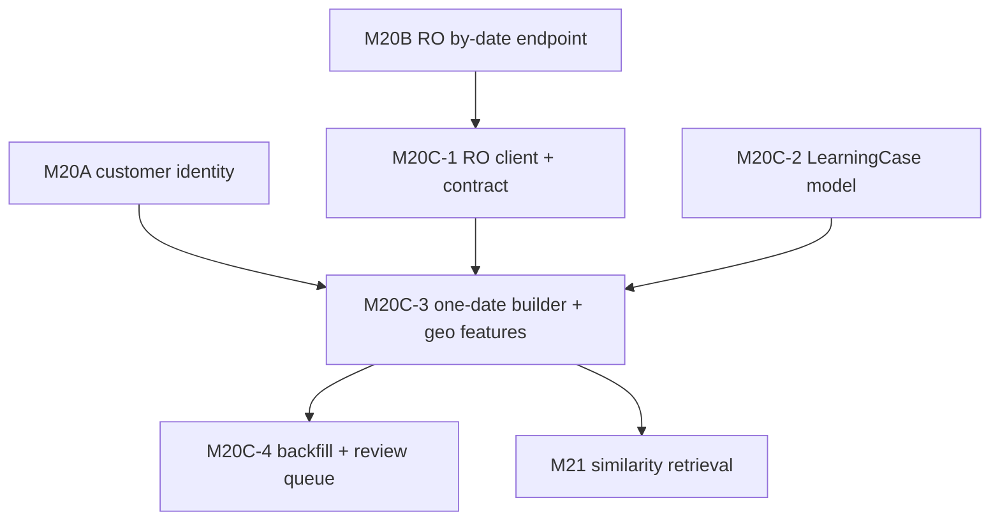

# M20C-0 — Admin Historical Learning + Geo-Feature Architecture Inspection

**Type:** Inspection and architecture planning only. No code changes in this milestone.  
**Date:** 2026-05-30  
**Repo:** Kapioo Admin (`kapioo-1`) only — Route Optimizer not inspected here (M20B assumed complete).  
**Inputs:** M19A/M19C/M19D docs, M20A customer identity, M20A.1 final-route identity, M20B RO by-date endpoint.  
**Audience:** Donald / Delivery AI Agent team

---

## 1. Executive summary

Kapioo Admin is **ready to start M20C-1** (RO by-date client + typed contract) with a clear, low-risk path to M20C-2 through M20C-4. The repo already has the right lifecycle folders, RO integration SSOT, geocode enrichment, coordinate coverage summaries, and M20A matching helpers. What is missing is entirely additive: a **read-only RO by-date client**, a **separate `DeliveryAgentLearningCase` model**, pure **geo-feature** and **route-shape** extractors, and a **one-date builder + backfill** pipeline.

**Key architectural decisions for M20C:**

1. **Separate `DeliveryAgentLearningCase` from `DeliveryAgentRun`.** Runs are live planning sessions; learning cases are frozen historical reconstructions per `(deliveryDate, profileId)`. Runs may link via sparse `deliveryAgentRunId`; they must not absorb full RO snapshots or geo fingerprints.
2. **Geo/spread features are first-class in M20C-2**, not deferred to M21. M21 similarity retrieval depends on precomputed `geoFeatures` and coordinate snapshots frozen at ingest time.
3. **Coordinate priority for learning:** RO historical lat/lng → Admin order lat/lng → `DeliveryAgentGeocodeCache` → address-only fallback. Do not call RO geocode during backfill unless explicitly enabled and rate-safe.
4. **Matching v1 stays conservative:** order ID first, derived RO name second only. Phone/address/LLM fallbacks go to M20C-4 review queue, not silent auto-match.
5. **Pure functions for geo features** under `lib/agents/delivery/learning/geo-features/` — no DB imports. Reuse `hasLatLng` / Manhattan distance patterns from `best-plan/operational/geo-helpers.ts`; add haversine km for spread/outlier math.
6. **Do not touch** candidate generation, scoring, final-route creation, or live order fetch defaults in M20C milestones.

**M20C milestone sequence (confirmed):**

| Milestone | Scope |
|-----------|--------|
| M20C-0 | This inspection (no code) |
| M20C-1 | RO by-date client + Zod contract + unit tests |
| M20C-2 | `DeliveryAgentLearningCase` model + geo/coordinate field contracts |
| M20C-3 | One-date builder: orders + RO fetch + match + geo/route/stop-control features |
| M20C-4 | Backfill 30–60 days + uncertain match review queue (API + minimal UI) |

---

## 2. Current relevant Admin structure

### 2.1 `lib/agents/delivery/` (existing modules)

```
lib/agents/delivery/
├── (root)           types, errors, run-log, get-delivery-orders-for-routing, map-order-to-routing-stop
├── candidate-plans/ generate, preview, handoff, North York split, route-shape repair
├── best-plan/       scoring, selection, operational/geo-helpers
├── customer-identity/   M20A — matchKapiooOrderToRoStop, formatRouteOptimizerCustomerName
├── final-route-run/ approved plan → RO batch create (do not change in M20C)
├── geocode/         enrich-routing-stops, cache, overlay, coverage summaries
├── planning-profile/ drivers, deadlines, weights (learning flags config-only today)
├── review-plan/     Donald review get/submit/reopen
└── feedback/        interpret feedback → planning hints
```

**No `learning/` folder exists yet.** M19C/M19D proposed it; M20C should create it.

### 2.2 Route Optimizer integration (outbound)

| File | Role |
|------|------|
| `lib/integrations/route-optimizer/config.ts` | `getRouteOptimizerConfig()`, `buildRouteOptimizerUrl()` — env: `ROUTE_OPTIMIZER_BASE_URL`, `ROUTE_OPTIMIZER_API_KEY` |
| `lib/integrations/route-optimizer/types.ts` | `ROUTE_OPTIMIZER_PATHS`, request/response TypeScript types |
| `lib/integrations/route-optimizer/client.ts` | Private `routeOptimizerPost()` — Bearer auth, error mapping |
| `lib/integrations/route-optimizer/errors.ts` | Typed errors: auth, rate limit, validation, network, response |

**Current paths in SSOT:** `optimizePreview`, `createAndOptimize`, `batchCreateAndOptimize`, `geocodeAddresses`. **`runsByDate` not yet added** (M20C-1).

### 2.3 Order data layer

| File | Role |
|------|------|
| `lib/order-data/get-daily-orders-base.ts` | Canonical Mongo fetch for `DailyDeliveryOrder` by date + statuses |
| `lib/agents/delivery/get-delivery-orders-for-routing.ts` | Adapter: validates, maps to `RoutingStop`, defaults `statuses: ["pending", "confirmed"]` |
| `models/DailyDeliveryOrder.ts` | Order storage |
| `models/DeliveryAgentGeocodeCache.ts` | Address-keyed lat/lng cache |

### 2.4 Persistence today

| Model | Role |
|-------|------|
| `DeliveryAgentRun` | Live planning session per `(deliveryDate, profileId)` via `duplicatePreventionKey` |
| `DeliveryAgentGeocodeCache` | Geocode cache for enrichment |

`DeliveryAgentLearningCase` **does not exist** — M20C-2.

### 2.5 Admin UI

| File | Role |
|------|------|
| `features/admin-delivery-agent/admin-delivery-agent-tab.tsx` | Main tab (~1.1k LOC — already dense) |
| `features/admin-delivery-agent/delivery-agent-review-panel.tsx` | Review + final create (~1.1k LOC) |
| `features/admin-delivery-agent/coordinate-coverage-banner.tsx` | Geocode coverage warning |

### 2.6 Existing geo/area utilities (reuse, not duplicate)

| Location | Exports |
|----------|---------|
| `best-plan/operational/geo-helpers.ts` | `hasLatLng`, `manhattanDistance`, `clamp`, `distanceToPoints` |
| `candidate-plans/classify-stop-for-planning.ts` | `classifyAreaBucket` → `core_dt`, `core_uptown`, `flexible_north_york`, `unknown` |
| `candidate-plans/classify-optimized-stop-area.ts` | Post-RO area buckets |
| `geocode/build-coordinate-coverage-summary.ts` | `buildCoordinateCoverageSummary` |
| `kitchen-start-location.ts` | `getKapiooKitchenStartLocation()` — string address only, no lat/lng today |

**Gap:** No haversine km helper, no bounding box, no same-building cluster detector, no dynamic outlier module.

---

## 3. Recommended M20C folder/module structure

Proposed layout (fits repo conventions; extends M19C/M19D):

```
lib/agents/delivery/
  learning/
    types.ts                          # Learning case contracts, enums, artifact versions
    historical-cases/
      build-learning-case-key.ts      # caseKey, sourceHash, duplicate prevention
      classify-learning-quality.ts    # positive/weak/negative/excluded rules
    matching/
      match-orders-to-ro-runs-for-date.ts   # one-date orchestrator (uses customer-identity SSOT)
      build-match-coverage-summary.ts
      types.ts                        # MatchedStop, UnmatchedOrder, UnmatchedRoStop
    geo-features/
      compute-delivery-geo-features.ts      # orchestrator (pure)
      compute-bounding-box.ts
      compute-center-point.ts
      compute-spread-km.ts
      detect-dynamic-outliers.ts
      compute-area-distribution.ts
      compute-cluster-density.ts
      detect-same-building-clusters.ts
      compute-distance-from-kitchen.ts
      compute-distance-from-handoff.ts
      types.ts
    route-shape/
      extract-route-shape-features.ts       # from RO runs snapshot
      extract-stop-control-features.ts
      types.ts
    coordinates/
      resolve-learning-coordinates.ts       # priority chain for learning snapshots
      build-coordinate-snapshots.ts
      types.ts                              # learning-specific coordinateSource enum
    backfill/
      backfill-learning-cases-for-date-range.ts
      pick-backfill-dates.ts
      types.ts
    review/
      build-uncertain-match-review-item.ts  # M20C-4
      types.ts
    retrieval/                            # M21 — stub folder or defer
      README.md                             # placeholder only

lib/integrations/route-optimizer/
  fetch-runs-by-date.ts               # M20C-1 client
  parse-runs-by-date-response.ts      # M20C-1 Zod parse + normalize
  runs-by-date-types.ts               # or extend types.ts

models/
  DeliveryAgentLearningCase.ts        # M20C-2
  DeliveryAgentHistoricalMatchReview.ts  # M20C-4

lib/contracts/
  delivery-agent-learning.ts          # M20C-2 shared API/contracts

app/api/admin/delivery-agent/
  learning/
    backfill/route.ts                 # M20C-4
    review/route.ts                   # M20C-4
    cases/[date]/route.ts             # optional read-only debug

__tests__/unit/agents/delivery/learning/   # mirrors source
__tests__/unit/integrations/route-optimizer/fetch-runs-by-date.test.ts
```

### A. File placement answers

| # | Question | Recommendation |
|---|----------|----------------|
| 1 | RO by-date client | `lib/integrations/route-optimizer/fetch-runs-by-date.ts` (+ parse helper) |
| 2 | RO by-date response types | `lib/integrations/route-optimizer/runs-by-date-types.ts` or section in `types.ts`; shared consumer types in `lib/contracts/delivery-agent-learning.ts` |
| 3 | LearningCase model | `models/DeliveryAgentLearningCase.ts` |
| 4 | Learning case builder | `lib/agents/delivery/learning/historical-cases/build-learning-case-for-date.ts` (orchestrator calling matching + features) |
| 5 | Matching logic | `lib/agents/delivery/learning/matching/` — **delegates to** `customer-identity/` SSOT, never reimplements |
| 6 | Geo/spread features | `lib/agents/delivery/learning/geo-features/` — pure functions |
| 7 | Backfill service | `lib/agents/delivery/learning/backfill/` + thin API route M20C-4 |
| 8 | Uncertain match review | `lib/agents/delivery/learning/review/` + `models/DeliveryAgentHistoricalMatchReview.ts` (M20C-4) |
| 9 | **Avoid touching** | `candidate-plans/*`, `best-plan/*`, `final-route-run/*`, `generate-improved-candidate-plans`, live `getDeliveryOrdersForRouting` defaults, `delivery-agent-review-panel.tsx` (except future collapsed learning section) |
| 10 | **Keep stable** | `customer-identity/`, `geocode/enrich-routing-stops.ts` (live path), `planning-profile/`, `review-plan/` submit flow, `run-log.ts` core APIs |

---

## 4. RO by-date client plan

### B. Inspection answers

| # | Answer |
|---|--------|
| 1 | Existing RO clients: `lib/integrations/route-optimizer/client.ts` — all POST today via private `routeOptimizerPost()` |
| 2 | Config: `lib/integrations/route-optimizer/config.ts` — `ROUTE_OPTIMIZER_BASE_URL`, `ROUTE_OPTIMIZER_API_KEY` |
| 3 | Paths SSOT: `lib/integrations/route-optimizer/types.ts` → `ROUTE_OPTIMIZER_PATHS` |
| 4 | Add `runsByDate: "/api/integrations/runs/by-date"` to `ROUTE_OPTIMIZER_PATHS` | **Yes — required in M20C-1** |
| 5 | `fetchRouteOptimizerRunsByDate(date)` lives in `lib/integrations/route-optimizer/fetch-runs-by-date.ts` | Can export from `client.ts` barrel or separate file (prefer separate + re-export for clarity — GET differs from POST helper) |
| 6 | Error handling — reuse existing error classes: | |
| | **401/403** | `RouteOptimizerAuthError` |
| | **404 not deployed** | `RouteOptimizerResponseError` with status 404 — caller treats as "endpoint unavailable" with retry/backoff message |
| | **429** | `RouteOptimizerRateLimitError` — backfill should sleep/retry |
| | **500** | `RouteOptimizerResponseError` — log, mark day failed, continue batch |
| | **Invalid JSON/shape** | `RouteOptimizerResponseError` after Zod parse failure — include path + truncated body in error |
| 7 | Validate with Zod? | **Yes.** RO integration types today are TS-only (no Zod in `lib/integrations/route-optimizer/`), but Admin API routes use Zod widely. Add `parseRunsByDateResponse()` with Zod schema in M20C-1 — matches guardrail for API contracts. Lenient `.passthrough()` on stop objects for forward compatibility. |
| 8 | Client tests | `__tests__/unit/integrations/route-optimizer/fetch-runs-by-date.test.ts` — mirror `client.test.ts`: config missing, auth header, 401/429/404/500, happy path JSON, malformed JSON, Zod rejection |

### Recommended GET client pattern

```typescript
// Pseudocode — do not implement in M20C-0
export async function fetchRouteOptimizerRunsByDate(
  date: string,
  options?: { includeDrafts?: boolean; minStops?: number }
): Promise<RouteOptimizerRunsByDateResponse>
```

- Build URL: `buildRouteOptimizerUrl(base, ROUTE_OPTIMIZER_PATHS.runsByDate) + ?date=...`
- `Authorization: Bearer ${apiKey}`
- Parse with Zod; normalize to internal contract used by learning builder
- Surface RO `warnings[]` unchanged into learning case metadata

---

## 5. Historical order snapshot plan

### C. Inspection answers

| # | Answer |
|---|--------|
| 1 | Daily orders stored in Mongo **`DailyDeliveryOrder`** (`models/DailyDeliveryOrder.ts`) |
| 2 | Historical fetch today: **`getDailyOrdersBase({ deliveryDate, statuses, ... })`** in `lib/order-data/get-daily-orders-base.ts` — no learning-specific wrapper yet |
| 3 | `getDeliveryOrdersForRouting()` — `lib/agents/delivery/get-delivery-orders-for-routing.ts` |
| 4 | Fetch by date with confirmed + delivered? | **Not as a dedicated function.** `getDeliveryOrdersForRouting` accepts optional `statuses` override; defaults are `["pending", "confirmed"]` only. Historical learning needs a **new wrapper** that passes `["confirmed", "delivered"]` without changing live defaults. |
| 5 | Where to add | `lib/agents/delivery/learning/historical-cases/get-historical-orders-for-learning.ts` calling `getDailyOrdersBase` or thin wrapper around `getDeliveryOrdersForRouting({ statuses: ["confirmed", "delivered"] })` |
| 6 | Available fields on `RoutingStop` / `DailyOrderBase`: | |

| Field | Source |
|-------|--------|
| order ID | `orderId` |
| customer name | `customerName` |
| phone | `customerPhone` |
| address | `formattedAddress`, `deliveryAddress.*` |
| unit / buzz / notes | `deliveryAddress.unitNumber`, `buzzCode`, `notes`, `specialInstructions` |
| area | `area` |
| status | `status` (`pending`, `confirmed`, `delivered`, …) |
| delivery date | `deliveryDate` |
| quantity / meals | `totalMealQuantity`, `items[]`, `mealSummary` |
| lat/lng | `lat`, `lng` on order if present (`order.deliveryAddress.lat/lng` mapped in `map-order-to-routing-stop.ts`) |

| 7 | Historical vs live selection | **Separate function** with explicit `HISTORICAL_LEARNING_STATUSES = ["confirmed", "delivered"]`. Live planning continues using `DEFAULT_ROUTING_STATUSES = ["pending", "confirmed"]` in `types.ts`. Never change the default. |
| 8 | Pure mapper separate from DB query? | **Yes.** Query → `DailyOrderBase[]` via order-data layer; pure `mapOrderToLearningOrderSnapshot(order)` in `learning/types.ts` or `historical-cases/map-order-to-learning-snapshot.ts`. Keeps builder testable without Mongo. |

### Recommended learning order snapshot shape (v1)

```typescript
type LearningOrderSnapshot = {
  orderId: string;
  customerName: string;
  customerPhone: string;
  formattedAddress: string;
  area: string;
  status: DailyOrderStatus;
  totalMealQuantity: number;
  unitNumber?: string;
  buzzCode?: string;
  notes?: string;
  lat?: number;
  lng?: number;
  coordinateSource?: string;  // from order if present
};
```

---

## 6. Coordinate snapshot + geoFeatures plan

### D. Inspection answers

| # | Answer |
|---|--------|
| 1 | `DeliveryAgentGeocodeCache` — `models/DeliveryAgentGeocodeCache.ts`; read/write via `lib/agents/delivery/geocode/geocode-cache.ts` |
| 2 | Geocode enrichment — `lib/agents/delivery/geocode/enrich-routing-stops.ts` (live planning path) |
| 3 | Coordinate coverage — `lib/agents/delivery/geocode/build-coordinate-coverage-summary.ts`, types in `geocode/types.ts` |
| 4 | M18 reuse | `overlay-coordinates-on-routing-stop.ts`, `build-enriched-routing-stop-lookup.ts` patterns for **priority resolution** — adapt for learning in `learning/coordinates/resolve-learning-coordinates.ts` (different priority order) |
| 5 | Priority feasibility | **Confirmed feasible** — see table below |

### Recommended coordinate source priority (learning-specific)

| Priority | Source | Notes |
|----------|--------|-------|
| 1 | `route_optimizer_historical` | RO by-date stop/customer lat/lng joined on matched stop |
| 2 | `order_data` | Admin order `lat/lng` if finite |
| 3 | `delivery_agent_cache` | `DeliveryAgentGeocodeCache` via `buildNormalizedAddressKey` |
| 4 | `route_optimizer_geocode` | Only if backfill flag enabled + rate-safe batching — **defer from default backfill** |
| 5 | `address_only` | No coordinates — `coordinateConfidence: none` |

**Do not** call live `enrichRoutingStops()` during backfill by default — it may hit RO geocode API and mutate cache aggressively. Prefer read-only cache lookup + RO historical coords.

### Enum recommendations

**`coordinateSource` (learning case — extend geocode types):**

```typescript
type LearningCoordinateSource =
  | "route_optimizer_historical"
  | "order_data"
  | "delivery_agent_cache"
  | "route_optimizer_geocode"   // optional backfill-only
  | "address_only"
  | "unavailable";
```

**`coordinateConfidence`:**

Reuse existing `geocode/types.ts`: `"high" | "medium" | "low"` plus learning-only **`"none"`** when address-only.

| Value | When |
|-------|------|
| `high` | RO historical or order_data with finite lat/lng |
| `medium` | cache hit, or RO geocode approximate |
| `low` | partial/legacy data |
| `none` | address-only fallback |

**`coordinateCoverage` shape (per learning case):**

Reuse and extend `DeliveryAgentCoordinateCoverageSummary`:

```typescript
type LearningCoordinateCoverage = {
  totalMatchedStops: number;
  stopsWithCoordinates: number;
  stopsAddressOnly: number;
  coveragePercent: number;
  sourceBreakdown: Record<LearningCoordinateSource, number>;
  handoffCoordinatesPresent: boolean;
  kitchenCoordinatesPresent: boolean;
  recommendationConfidence: "high" | "medium" | "low";
  warnings: string[];
};
```

**Warnings for missing coordinates:** Store in learning case `warnings[]` and per-stop `coordinateWarnings[]` (e.g. `"handoff_lat_lng_missing"`, `"flexible_north_york_no_coords"`).

**Synthetic handoff coordinates:** Copy from RO by-date when `is_synthetic === true` or `stop_type === "handoff"` — lat/lng joined from `customers[]` via `customer_index`. If missing, set `handoffCoordinatesPresent: false` and warning — **do not guess** from address in v1.

**Kitchen coordinates:** `getKapiooKitchenStartLocation()` returns **string only** today. For `maxDistanceFromKitchenKm`, either (a) geocode kitchen once and cache in env/config as lat/lng later, or (b) omit km metric in v1 and store `kitchenStartLocationText` only with warning `"kitchen_coordinates_unconfigured"`.

---

## 7. Route shape + stop-control feature plan

### E. Geo-feature architecture

| # | Answer |
|---|--------|
| 1 | Distance helpers | `manhattanDistance` in `geo-helpers.ts` — planning heuristic only. **Add haversine km** in `learning/geo-features/` for spread/outliers |
| 2 | Lat/lng types | `{ lat: number; lng: number }` ad hoc; `hasLatLng()` in geo-helpers. Add `GeoPoint` type in `learning/geo-features/types.ts` |
| 3 | Area classification | `classifyAreaBucket()` in `classify-stop-for-planning.ts` — reuse for `areaDistribution` |
| 4 | Cluster logic | Scoring-only today (`scoreLatLngClusterFit`); no DB clustering. Same-building detection = **new pure function** (proximity threshold ~25–50m) |
| 5 | Where geo functions live | `lib/agents/delivery/learning/geo-features/` |
| 6 | Pure, no DB? | **Yes — mandatory.** Inputs: coordinate snapshots + optional kitchen/handoff points |
| 7 | v1 `geoFeatures` to store | See minimum list below |
| 8 | Defer to M21 | `clusterDensity` fine-grained grid, embedding vectors, RAG fingerprint strings, kitchen km if no kitchen lat/lng config |
| 9 | Tests | Pure fixture tests under `__tests__/unit/agents/delivery/learning/geo-features/` |

**Minimum v1 `geoFeatures`:**

```typescript
type LearningGeoFeatures = {
  coordinateCoverage: LearningCoordinateCoverage;
  boundingBox: { minLat: number; maxLat: number; minLng: number; maxLng: number } | null;
  centerPoint: { lat: number; lng: number } | null;
  spreadKm: { northSouth: number; eastWest: number } | null;
  maxDistanceFromCenterKm: number | null;
  maxDistanceFromKitchenKm: number | null;  // null + warning if kitchen lat/lng unknown
  maxDistanceFromHandoffKm: number | null;
  dynamicOutliers: Array<{ orderId?: string; stopRef: string; distanceFromCenterKm: number; reason: string }>;
  areaDistribution: Record<PlanningAreaBucket | string, number>;
  sameBuildingClusterCount: number;
  sameBuildingClusters: Array<{ clusterId: string; orderIds: string[]; center: GeoPoint }>;
  majorClusterSummary?: string;  // optional compact text for M21
};
```

### F. Route shape features

| Feature | From RO by-date v1? | Notes |
|---------|---------------------|-------|
| `runCount` | Yes | `runs.length` |
| `supportRunUsed` | Partial | Infer from `driver_name` matching profile support slot (e.g. Self/Donald) — config-driven |
| `kitchenStartRunCount` | Partial | Runs where first stop `is_first_stop` or start near kitchen text |
| `handoffStartRunCount` | Partial | Receiver run first stop is handoff synthetic |
| `providerBeforeHandoffStopCount` | Infer | Count provider-run stops before handoff sequence position |
| `handoffSequencePosition` | Yes | From synthetic stop `sequence` |
| `receiverStartsAtHandoff` | Infer | First non-synthetic stop on receiver run is handoff |
| `backtrackingRisk` | Later | Needs ordered lat/lng path analysis — M21 |
| `routeDirectionSmoothness` | Later | M21 |
| `deadlineBufferMinutes` | Partial | From `run_completed_at` vs 13:00 local deadline |
| `runCompletedBefore1pm` | Yes | Compare `run_completed_at` / max `completed_at` to 1 PM ET |
| `lateMinutes` | Yes | If after 1 PM |
| `etaBasisQuality` | Yes | RO `eta_basis` rollup: prefer days with `post_start` |
| `actualVsEtaErrorMinutes` | Yes | Per stop `completed_at - arrival_time` when both present |

**Where route-shape functions live:** `lib/agents/delivery/learning/route-shape/extract-route-shape-features.ts`

**v1 store in learning case:** `routeShapeFeatures` + `stopControlFeatures` (below) + `outcomeFeatures`

**Tests:** Fixture RO snapshots with 1–3 runs, handoff, late/on-time cases

### G. Fixed stop / end stop / handoff learning

| # | Answer |
|---|--------|
| 1 | Direct from RO | `fixed_stop_position`, `is_first_stop`, `is_end_point`, `start_location`, `end_location`, `is_synthetic`, `stop_type`, stop `sequence`, `customer_index` |
| 2 | Needs inference | `receiverStartsAtHandoff`, `providerBeforeHandoffStopCount`, `supportRunUsed`, stop-control **reasons** |
| 3 | Warnings/unknown | When inference ambiguous → `stopControlFeatures.unknownFlags[]` — never guess Donald intent |
| 4 | Avoid over-inference | Store **raw RO flags** verbatim in `stopControlFeatures.raw`; computed fields marked `inferred: true` |
| 5 | Save for M22 LLM | Per-run arrays: `{ runId, driverName, stops: [{ sequence, flags, orderIds, isSynthetic, stopType }] }`, plus run-level `startLocation`, `endLocation` text |

**Recommended `stopControlFeatures` v1:**

```typescript
type LearningStopControlFeatures = {
  runs: Array<{
    runId: string;
    driverName: string;
    startLocation?: string;
    endLocation?: string;
    stops: Array<{
      sequence: number;
      fixedStopPosition?: number | null;
      isFirstStop?: boolean;
      isEndPoint?: boolean;
      isSynthetic?: boolean;
      stopType?: string;
      orderIds?: string[];
    }>;
    inferred?: {
      receiverStartsAtHandoff?: boolean | null;
      providerStopsBeforeHandoffCount?: number | null;
    };
  }>;
  unknownFlags: string[];
  warnings: string[];
};
```

---

## 8. DeliveryAgentLearningCase schema recommendation

### H. Schema sections (M20C-2 — design only)

**Artifact version:** `learning-case-v1`

#### 1. Identity (indexed)

| Field | Type | Notes |
|-------|------|-------|
| `deliveryDate` | string | `YYYY-MM-DD` |
| `profileId` | string | e.g. `daily-default` |
| `caseKey` | string | unique: `learning-case:{deliveryDate}:{profileId}` |
| `sourceHash` | string | hash(frozen orders + RO runs) for idempotent re-ingest |
| `backfillBatchId` | string? | optional batch tag |
| `deliveryAgentRunId` | ObjectId? | sparse link when agent-era day exists |
| `schemaVersion` | string | `learning-case-v1` |

#### 2. Source snapshots (Mixed, typed)

| Field | Content |
|-------|---------|
| `adminOrdersSnapshot` | `LearningOrderSnapshot[]` at ingest |
| `routeOptimizerRunsSnapshot` | Normalized RO by-date response (frozen) |
| `ingestedAt` | ISO timestamp |

#### 3. Matching results

| Field | Content |
|-------|---------|
| `matchedStops` | `{ orderId, roRunId, roStopSequence, matchMethod, matchConfidence, ... }[]` |
| `unmatchedOrders` | orders with no RO stop |
| `unmatchedRoStops` | RO stops with no order (includes synthetic — tagged) |
| `matchCoverage` | `{ matched, totalOrders, totalRoCustomerStops, percent }` |
| `matchConfidenceSummary` | `{ exact, high, none, needsReview }` |

#### 4. Coordinate snapshots

| Field | Content |
|-------|---------|
| `coordinateSnapshots` | Per matched order + handoff/start/end points |
| `coordinateCoverage` | rollup (see §6) |

Each snapshot entry:

```typescript
{
  ref: string;           // orderId or "handoff:runId" or "kitchen"
  lat?: number;
  lng?: number;
  coordinateSource: LearningCoordinateSource;
  coordinateConfidence: "high" | "medium" | "low" | "none";
  warnings?: string[];
}
```

#### 5–8. Feature buckets

| Field | Content |
|-------|---------|
| `geoFeatures` | §6 minimum v1 |
| `routeShapeFeatures` | §7 |
| `stopControlFeatures` | §7G |
| `outcomeFeatures` | `{ runCompletedBefore1pm, lateMinutes, etaBasisQuality, perStopEtaErrors[], actualStartTimes[] }` |

#### 9. Quality / learning label (indexed)

| Field | Type |
|-------|------|
| `learningLabel` | `positive` \| `weak_positive` \| `negative` \| `avoid_pattern` \| `uncertain` \| `excluded` |
| `learningWeight` | number 0..1 |
| `dataQualityScore` | number 0..100 |
| `excludeReason` | string? |

#### 10–13. Meta

| Field | Content |
|-------|---------|
| `warnings` | string[] — RO warnings + ingest warnings |
| `reviewStatus` | `none` \| `pending` \| `reviewed` |
| `createdAt` / `updatedAt` | Mongoose timestamps |

### Indexes

```text
{ caseKey: 1 }                           unique
{ deliveryDate: 1, profileId: 1 }        unique compound (alternate to caseKey)
{ learningLabel: 1, deliveryDate: -1 }
{ dataQualityScore: -1 }
{ reviewStatus: 1, deliveryDate: -1 }
{ deliveryAgentRunId: 1 }                sparse
```

Optional later: 2dsphere on `geoFeatures.centerPoint` if Mongo geo queries needed — **not v1**.

### Storage separation questions

| # | Answer |
|---|--------|
| 1 | Separate `DeliveryAgentLearningCase` | **Yes** — do not bloat `DeliveryAgentRun` |
| 2 | Keep in `DeliveryAgentRun` | Live session state, planning artifacts, review histories, pointers only (`retrievedLearningCaseIds[]` in M21) |
| 3 | Prevent run bloat | No RO snapshots or geo fingerprints on run doc; link by id |
| 4 | Schema versioning | `schemaVersion` + typed TS contracts; bump to `learning-case-v2` for breaking changes; never silently overwrite Donald-labeled cases — set `supersededAt` on re-ingest |

---

## 9. Matching/confidence plan

### I. M20A integration

| # | Answer |
|---|--------|
| 1 | One-date matching service | `lib/agents/delivery/learning/matching/match-orders-to-ro-runs-for-date.ts` |
| 2 | Matching output | Array of `HistoricalOrderStopMatchResult` (existing type) + join metadata `{ roRunId, roStopSequence, roStopRef }` |
| 3 | Auto-accept | `matched && confidence === "exact"` (order_id) or `method === "derived_route_optimizer_name" && confidence === "high"` |
| 4 | Uncertain | No match; multiple candidates (future); derived name without phone last4; RO stop with empty order_ids and weak name match |
| 5 | Review queue (M20C-4) | Side-by-side: RO stop name/phone/address/order_ids vs top 1–3 Kapioo order candidates + match reason |
| 6 | Unmatched synthetic handoff | **Expected** — tag as `unmatchedRoStops` with `isSynthetic: true`, not an error; use for handoff coordinate features |
| 7 | Duplicate possible matches | One order → one stop max in v1; if two stops claim same order_id, flag case `uncertain` + review item |
| 8 | Match coverage | `matchedOrders / totalValidHistoricalOrders` (exclude invalid/non-daily-area) |
| 9 | v1 matching scope | **Order ID + derived name only** — same as M20A |
| 10 | Recommendation | **Conservative v1** — no phone/address fallback until M20C-4 review path exists |

**SSOT rule:** Only `customer-identity/match-kapioo-order-to-ro-stop.ts` performs match logic; learning matcher loops orders × stops and aggregates.

---

## 10. Learning quality classification plan

### J. v1 classification rules

| Label | Conditions |
|-------|------------|
| `positive` | `runCompletedBefore1pm === true` AND `matchCoverage >= 90%` AND `coordinateCoverage >= 80%` AND (`eta_basis` post_start on majority of stops OR Donald approved) |
| `weak_positive` | Completed before 1 PM but low match coverage OR planned-only ETAs OR no `actual_start_time` |
| `negative` | Late after 1 PM with otherwise good data |
| `avoid_pattern` | Late + Donald rejected OR explicit feedback tags indicating bad pattern |
| `uncertain` | Match coverage < 70% OR duplicate match conflict OR low coordinate coverage |
| `excluded` | RO drafts only / zero completed stops / test heuristics (manual driver name, 1-stop run, no actual_start) |

**Donald approval boost:** If linked `DeliveryAgentRun.reviewStatus === "approved"` → upgrade weight toward `positive` but **do not override late** — store both signals.

**Data quality score (0–100):** Weighted: match coverage 40%, coordinate coverage 30%, ETA quality 20%, outcome known 10%.

| Use case | Rule |
|----------|------|
| Positive retrieval example | `learningLabel === "positive"` AND `dataQualityScore >= 75` |
| Exclude from training | `excluded` OR `avoid_pattern` with late > 30 min |
| Send to review | `uncertain` OR match conflict OR coverage < 70% |

**LLM context fields (M22):** `geoFeatures.majorClusterSummary`, `stopControlFeatures` raw flags, `routeShapeFeatures.runCount`, area distribution, Donald approval/feedback snippets from linked run — not full order PII dump.

---

## 11. Backfill architecture plan

### K. Recommendations (M20C-4 — design only)

| # | Answer |
|---|--------|
| 1 | Location | `lib/agents/delivery/learning/backfill/backfill-learning-cases-for-date-range.ts` |
| 2 | Pick dates | Last 30–60 **calendar delivery dates** with at least one `confirmed` or `delivered` order; skip dates already having `caseKey` unless `force=true` |
| 3 | Trigger | **CLI/script first** (`scripts/backfill-delivery-learning-cases.ts`) then optional admin API `POST /api/admin/delivery-agent/learning/backfill` |
| 4 | Duplicate prevention | Unique `caseKey`; compare `sourceHash` on re-run — no-op if unchanged |
| 5 | Idempotency | Upsert by `caseKey`; never overwrite `learningLabel` if manually set / Donald reviewed without `force` |
| 6 | Progress log | Structured console + optional `DeliveryAgentBackfillLog` collection later; v1: stdout JSON lines per date |
| 7 | RO failures | Catch typed RO errors; record `{ date, error, retryable }`; continue to next date |
| 8 | Partial day failures | Save case with `learningLabel: uncertain` + warnings if RO ok but matching poor |
| 9 | Failed attempts | Optional lightweight `learningBackfillFailures[]` on admin settings doc or separate log — **v1: log file sufficient** |
| 10 | Tests before backfill | Client contract, builder unit tests, idempotent upsert integration test with mocked RO + orders |

**Rate limiting:** Sequential dates, 1 RO request per date, retry 429 with backoff — do not parallelize against RO.

---

## 12. Future review queue plan

### L. UI/API placement (M20C-4+)

| # | Recommendation |
|---|----------------|
| 1 | API routes | `app/api/admin/delivery-agent/learning/review/route.ts` (list pending), `.../review/[reviewKey]/route.ts` (accept/edit/ignore) |
| 2 | UI component | `features/admin-delivery-agent/learning-review-panel.tsx` — **separate collapsible section**, not inline in review panel |
| 3 | Donald sees | Date, RO stop name/phone, proposed order, match method, confidence, one-click Accept / Edit order ID / Ignore |
| 4 | Hidden by default | Raw JSON snapshots, geo feature numbers, full RO run dump — expand "Details" only |
| 5 | Avoid clutter | New sub-tab **"Learning"** under Delivery Agent tab, or link from admin sidebar — do not add to daily planning flow |
| 6 | Separate from daily planning | **Yes** — review queue is historical/backfill concern, not blocking daily approve flow |

---

## 13. SSOT/dependency risks

### M. Dependency direction

| Rule | Status |
|------|--------|
| Geo functions pure, no DB | Enforce in `learning/geo-features/` |
| Matching SSOT in `customer-identity/` | M20A done — do not duplicate |
| RO paths in `ROUTE_OPTIMIZER_PATHS` | Add in M20C-1 |
| Learning case ≠ run logic duplicate | Shared types in `lib/contracts/delivery-agent-learning.ts`; run keeps pointers only |
| API routes thin | `learning/backfill/route.ts` → service only |
| UI no backend imports | Fetch API only |

**Reuse existing SSOT:**

- `customer-identity/*`
- `geocode/normalize-address-key.ts`, `geocode-cache.ts`
- `geocode/types.ts` (extend for learning enums)
- `classify-stop-for-planning.ts` area buckets
- `planning-profile/get-profile.ts` for driver slot names
- `run-log.ts` `findDeliveryAgentRunByDuplicateKey` for linking agent-era days

**Avoid duplicating:**

- RO customer name formatting (use `formatRouteOptimizerCustomerName`)
- Final route external_id/idempotency (unchanged)
- Coordinate overlay logic (adapt, don't copy-paste priority chains)

**New SSOT before M20C-1:**

- `ROUTE_OPTIMIZER_PATHS.runsByDate`
- `lib/contracts/delivery-agent-learning.ts` (started in M20C-1 with RO response types)

**Circular import risks:**

- `learning/matching` → `customer-identity` ✓
- `learning/coordinates` → `geocode-cache` (DB) — OK at service layer, not inside geo-features pure module
- Keep `geo-features` importing only `learning/geo-features/types` + `classify-stop-for-planning` (pure)

**Do not touch in M20C:**

- `candidate-plans/generate-candidate-plans.ts`
- `best-plan/score-candidate-plan.ts`
- `final-route-run/create-final-route-run-from-approved-plan.ts`
- `get-delivery-orders-for-routing.ts` default statuses

---

## 14. Testing/verification plan

### N. Recommended tests (future milestones)

| # | Test | Path |
|---|------|------|
| 1 | RO by-date client + Zod | `__tests__/unit/integrations/route-optimizer/fetch-runs-by-date.test.ts` |
| 2 | Order snapshot extraction | `__tests__/unit/agents/delivery/learning/historical-cases/map-order-to-learning-snapshot.test.ts` |
| 3 | Customer identity matching integration | `__tests__/unit/agents/delivery/learning/matching/match-orders-to-ro-runs.test.ts` |
| 4 | Duplicate/unmatched handling | same file — conflict + synthetic handoff cases |
| 5 | Coordinate source priority | `__tests__/unit/agents/delivery/learning/coordinates/resolve-learning-coordinates.test.ts` |
| 6 | Geo features | `__tests__/unit/agents/delivery/learning/geo-features/*.test.ts` |
| 7 | Route shape extraction | `__tests__/unit/agents/delivery/learning/route-shape/extract-route-shape-features.test.ts` |
| 8 | Stop control extraction | `__tests__/unit/agents/delivery/learning/route-shape/extract-stop-control-features.test.ts` |
| 9 | Learning quality classification | `__tests__/unit/agents/delivery/learning/historical-cases/classify-learning-quality.test.ts` |
| 10 | Backfill idempotency | `__tests__/integration/agents/delivery/learning/backfill.test.ts` |
| 11 | Review queue shape | `__tests__/unit/agents/delivery/learning/review/build-uncertain-match-review-item.test.ts` |

**Test command (after implementation):**

```bash
npx vitest run __tests__/unit/integrations/route-optimizer/fetch-runs-by-date.test.ts __tests__/unit/agents/delivery/learning/
```

**Future DOM verification attributes (M20C-4 UI):**

```html
data-verify-unit="delivery-agent-learning-case"
data-match-coverage="92"
data-coordinate-coverage="88"
data-learning-label="positive"
data-unmatched-orders="2"
data-unmatched-stops="1"
data-review-status="none"
```

---

## 15. Go/no-go for M20C-1

| # | Answer |
|---|--------|
| 1 | Admin repo ready for M20C-1? | **Yes** — prerequisites (M20A matching, M20B RO endpoint, integration client patterns) are in place |
| 2 | M20C-1 scope = RO client + contract only? | **Yes** — smallest safe increment: path SSOT, GET client, Zod parse, typed exports, unit tests. No model, no builder |
| 3 | M20C-2 = LearningCase model + geo field contracts? | **Yes** — define schema + TS types + indexes; optional empty builder stub |
| 4 | Structure cleanup before M20C-1? | **No blocking cleanup** — optional: add empty `learning/` README. Do not refactor review panel or final-route create |
| 5 | M20C-1 files to add | `lib/integrations/route-optimizer/fetch-runs-by-date.ts`, `parse-runs-by-date-response.ts`, extend `types.ts`, `lib/contracts/delivery-agent-learning.ts` (RO response section), tests |
| 6 | M20C-1 files to avoid | All of `candidate-plans/`, `best-plan/`, `final-route-run/`, `features/admin-delivery-agent/*`, `models/*` (except no touch) |
| 7 | Decisions needed from Donald | See §16 |

**Go for M20C-1:** ✅

---

## 16. Exact M20C-1 scope recommendation

### In scope (M20C-1 only)

1. Add `runsByDate` to `ROUTE_OPTIMIZER_PATHS`
2. Implement `fetchRouteOptimizerRunsByDate(date, options?)` with GET + Bearer auth
3. Zod schema + `parseRouteOptimizerRunsByDateResponse()`
4. Export types: `RouteOptimizerRunsByDateResponse`, `RouteOptimizerHistoricalRun`, `RouteOptimizerHistoricalStop`, etc.
5. Unit tests mirroring existing `client.test.ts` patterns
6. Document endpoint in comment block or short addition to existing integration doc if one exists in Admin repo

### Out of scope (defer)

- `DeliveryAgentLearningCase` model (M20C-2)
- Order fetch wrapper (M20C-3)
- Matching builder (M20C-3)
- Geo features (M20C-3)
- Backfill (M20C-4)
- UI / API routes for learning
- Any change to live planning pipeline

### Questions for Donald before coding M20C-1+

1. **Profile scope:** Backfill only `daily-default` profile or all planning profiles?
2. **Kitchen lat/lng:** Can we add `KAPIOO_KITCHEN_LAT` / `KAPIOO_KITCHEN_LNG` env vars for distance metrics, or stay address-text-only in v1?
3. **Historical order statuses:** Confirm `confirmed + delivered` only (exclude `pending`) for backfill corpus?
4. **RO run filter:** Backfill all RO runs for date, or only `created_by_integration === "kapioo-admin"` when present?
5. **Re-ingest policy:** If Donald later labels a case, should automatic re-backfill skip it unless `force=true`?
6. **Test run exclusion:** Any known `driver_name` values that always mean test (e.g. "Test")?
7. **Coordinate gap tolerance:** Minimum `coordinateCoverage` percent before case is `uncertain` vs `excluded`?

---

## Appendix: M20C milestone dependency graph



---

*End of M20C-0 inspection. No code was modified in this milestone.*
